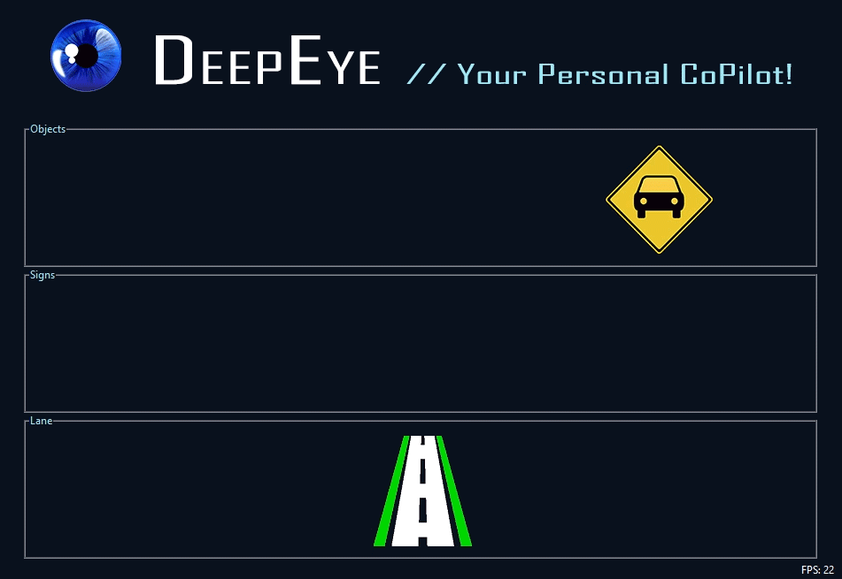

# DeepEye
This research project introduces a new framework for Advanced Driver-Assistance Systems (ADAS) called **DeepEye**. *DeepEye* is a computer vision-based copilot system powered by a deep convolutional neural network to perform real-time scene recognition. The system uses Tensorflow to classify relevant objects surrounding the driver. It also uses a set of image processing functions from the Open Computer Vision library to estimate whether the car is staying in the lane. It then alerts the driver if an object or a situation poses a potential threat through a custom-designed dashboard (warning interface). According to our testing results, we believe that our system would be a useful backup solution for automobiles equipped with ADAS sensory-based systems, particularly when sensors' feeds are not available. We evaluated the system performance on an hour's worth of driving videos running on a Titan XP GPU. We concluded that the system is up to $92\%$ accurate in various weather conditions, times of day, and geospatial locations. This includes heavy thunderstorms, crowded areas, tunnels and highways, based on footage collected from both dash-cam feeds and synthetic video data from Grand Theft Auto V. We strongly believe the framework could be further improved by replacing our single-vision camera approach with multiple stereo-vision cameras to account for blind-spots and 3-dimensional depth perception. Furthermore, advanced sensors such as LIDARs and RADARs would also enhance our scene recognition, as they can accurately estimate trajectory and distance. We also faced several issues due to hardware limitations, which is understandable given the notion and complexity of image processing on a single GPU. With the right hardware onboard, *DeepEye* is an effective framework that contains most of the fundamental basis for real-life copilot and autopilot systems.

DeepEye DashCam | DeepEye DashBoard 
:-------------------------:|:-------------------------:
 |  
