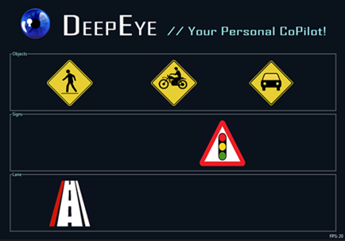

# DeepEye: UserInterface

## Table of Contents
1. [Introduction](#introduction)
2. [Methods](#methods)
3. [Customization](#customization)

User Interface          |  Warning Interface
:-------------------------:|:-------------------------:
  |  

## Introduction
This is a Graphical User Interface that pops up as soon as main is run.  This allows the user to change certain useful parameters for running the program, detailed below.  Once the user clicks "Run", the program launches with the given parameters.
The code makes use of the Tkinter library.  The boilerplate code (for widget creation and placement) was generated using [Page](http://page.sourceforge.net/), a drag-and-drop Python GUI creation tool.

## Methods
Name | Description 
--- | ---
**Window** | This is the main class that contains all the widgets and their associated variables, positioning and default values.
**FlipState** | This method controls whether the custom window width and height are enabled or disabled based on the state of the checkbox above them.
**runProgram** | This method calls the [DrivingAssistant](../README.md) class to start the program.  But first, it converts the values of the widget variables (such as turning strings to ints) so that they can be properly understood when passed to the DrivingAssistant class.  After the program is finished running, the GUI closes.    
 
## Customization
Name | Description 
--- | ---
**Monitor ID** | This selects which monitor to feed frames.  The default values are 0, 1 , and 2.  For the typical dual-monitor setup, 0 is both, whereas 1 and 2 are the other individual monitors.  Eventually this will hopefully be populated only by options available to the user.
**Custom Window Size** | If the Set Custom Window Size button is not checked, then the frame size will default to the size of the entire monitor that's feeding the visual stream.  If it's checked, this allows the user to enter a custom size (a smaller window size results in better performance).
**Top/Left Offset** | By default, the visual stream will be feeding from the very top left corner on the monitor, even with a custom smaller window size.  Adding an offset allows the user to change what part of the screen is being fed to the visual feed.
**CNN** | There are three options for changing the feature identifier model. The default is Resnet101, which gives us the best hardware performance.  NAS is a more accurate model, however its performance is slower.  Inception-Resnet is a compromise between the two, however we found that it didn't perform any better for us.
**Dataset** | There are two options: Coco and Kitti.  Coco is an American trained dataset, with more classes, so this is the default option.  Kitti has less classes, and was trained in Europe.
**Threshold** | This controls the confidence threshold cutoff for detected objects.  Any object detected with a confidence below the set threshold will not be displayed onscreen.  The default value is 85%.
**Lane Detection** | Toggles whether lane detection runs.  Requires heavy computing resources.

*Note:* press the (ESC) key to exit out of the loop.