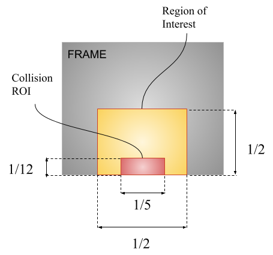

# DeepEye: ObjectClassifier

## Table of Contents
1. [Introduction](#introduction)
2. [Methods](#methods)
3. [Customization](#customization)
4. [Licensing Information](#licensing-information)

## Introduction
This class is a deep convolutional neural network implemented using Tensorflow Object Detection API. The API has models trained on the [COCO dataset](http://cocodataset.org/#home) and [KITTI dataset](http://www.cvlibs.net/datasets/kitti/). For more information about the API please refer to [Tensorflow Object Detection API](https://github.com/tensorflow/models/tree/master/research/object_detection)

We will be using this API for three purposes:
- Detecting relevant objects,
- Creating bounding boxes, and
- Classifying the objects (car, pedestrian, motorcycle, etc.)

## Methods
Name | Description 
--- | ---
**\_\_init\_\_** | The constructor doesn't necessarily require passing any parameters as they all have some satisfactory default values to start with. See [Customization](#customization) for detailed information. 
**download_model()** | Download pre-trained model from the tensorflow object detection API.
**load_model()** | Load pre-trained model into memory.
**setup()** | This method would download a trained model from the API if necessary files were not found. And, it loads the trained model into memory - preferably GPU memory using the methods stated above. Then, prep. the tensorflow computation graph and initiates a tensorflow session.
**scan_road()** | Capture frames and detecte objects.
**threat_classifier()** | Evaluate detected objects and return a dictionary to indicate any potential threats.

## Customization
### Model Architecture
The API lists many different pre-trained models of the state-of-the-art CNN architectures including SSD, Inception, Resnet, R-CNN, NAS, etc... By default, our implementation uses the (faster_rcnn_nas | mAP=43) model. It's relatively slow but has one of the best mean average precision (mAP) as of today's standards. 

**Note:** mAP is is the product of precision and recall on detecting bounding boxes. In short, the higher the mAP score, the more accurate the network is but that comes at the cost of processing speed.

To use a different classifier and/or different dataset you'll need to look at:

Parameter | Description 
--- | ---
**classifier_codename** | Codename of the pre-trained model used for object detection **([list of available models](https://github.com/tensorflow/models/blob/master/research/object_detection/g3doc/detection_model_zoo.md))**.
**dataset_codename** | Codename of the dataset that the model was trained on (available datasets: **mscoco, kitti**).
**classifier_threshold** | The decision threshold : all detection scores below this given threshold will be discarded **(0.75 by default)**.

### Detection

We limited pedestrian warnings to only people who are crossing in front of the driver. Furthermore, we limited vehicles/bikes warnings to only alert the driver if the object is close enough to the car by excluding any objects that are detected outside of a predefined area in the given frame *(our mian region of interest (ROI) highlighted in yellow in the graph below)*. Similarly, we added a **(Vision-based Collision Detection)** to alert the driver if there's any potential collision with an object surrounding the car by scanning the given frame and checking if the bottom part of an object was detected within the *(COLLISION ROI) highlighted in red in the graph below)*.

 

## Licensing Information
The following code was adapted from the Tensorflow Object Detection API licensed under [Apache License 2.0](https://github.com/tensorflow/models/blob/master/LICENSE).

Original SourceCode could be found @ [object_detection_tutorial](https://github.com/tensorflow/models/blob/master/research/object_detection/object_detection_tutorial.ipynb)
